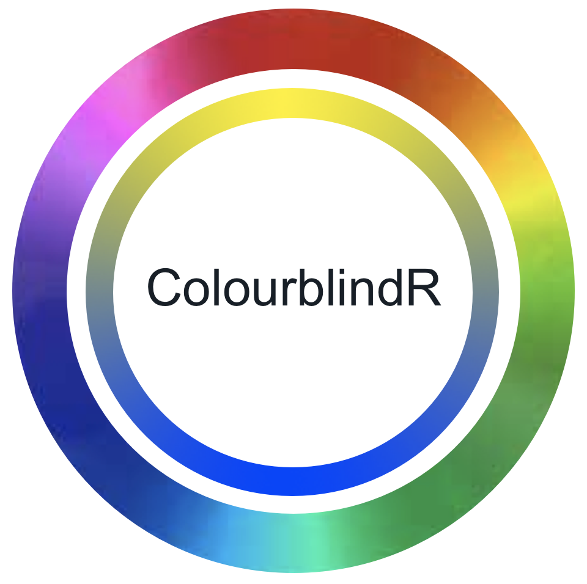
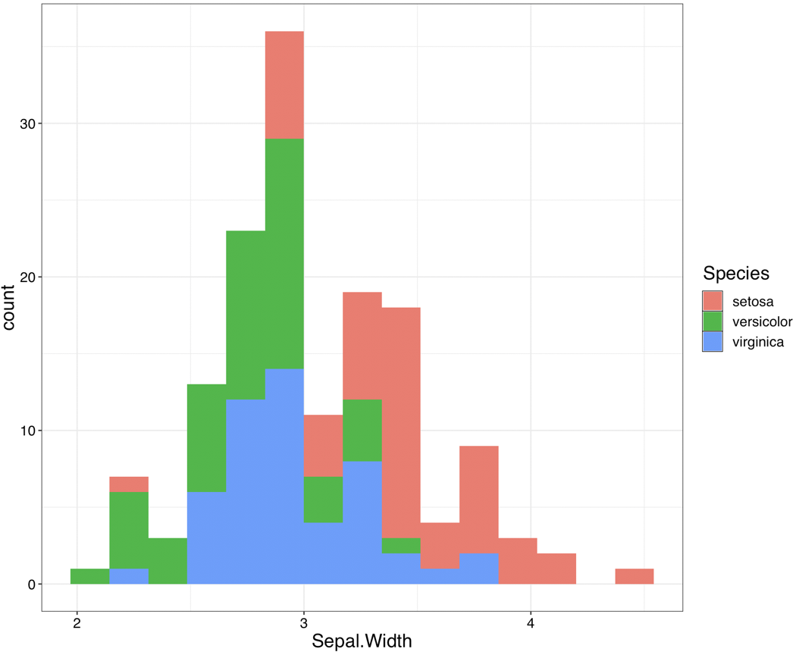
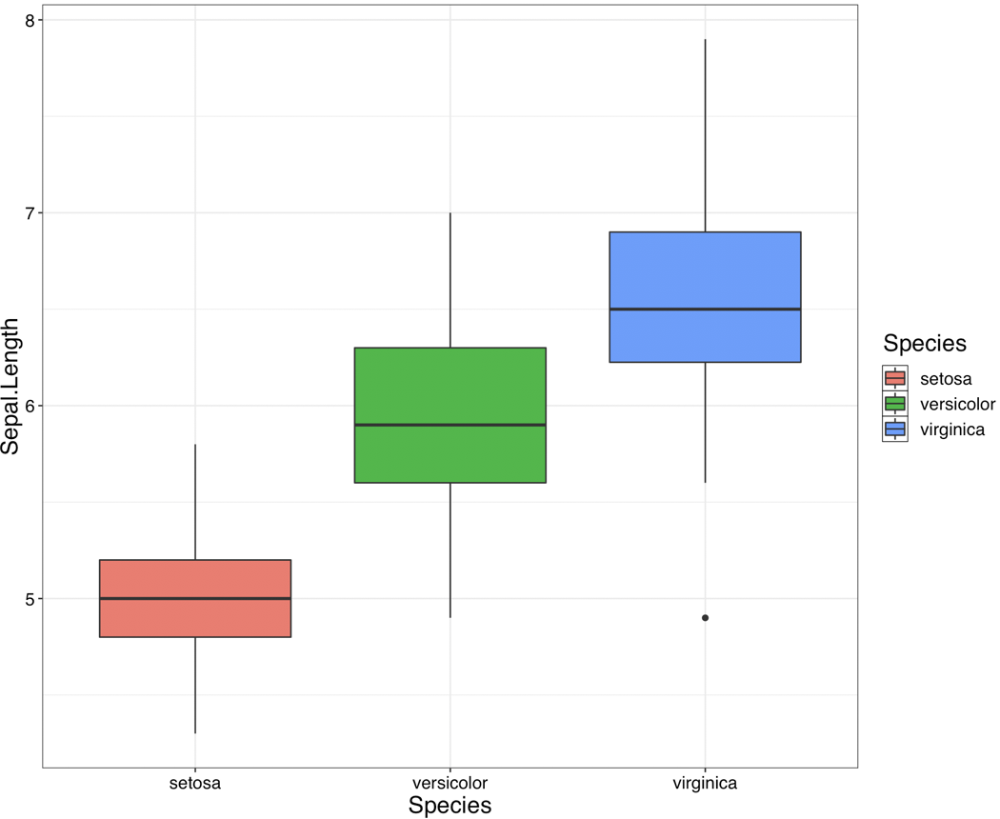
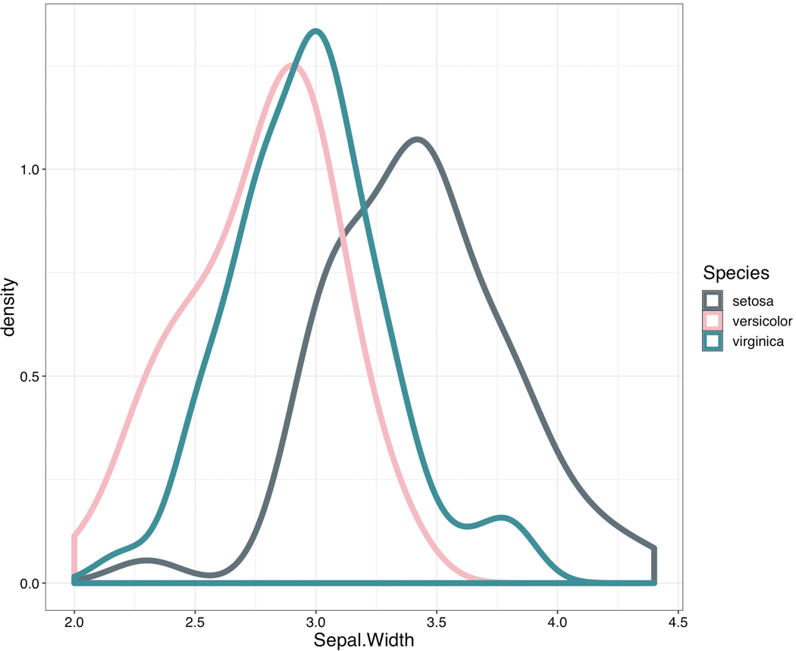

# ColourblindR

[](https://travis-ci.org/UBC-MDS/ColourblindR)

An R package that creates colourblind friendly themes.

### Authors

| [Ian Flores](https://github.com/ian-flores) | [Sabrina Tse](https://github.com/sabrinatkk) | [Hayley Boyce](https://github.com/hfboyce)
|:------------:|:--------------:|:--------------:|

### Project Summary  

`ColourblindR`, deployed in March 2019, is a brand new theme package implemented for `ggplot2` to optimize graphs into a format interpretable by people with colourblindness. Colourblindness, also known as colour vision deficiency, is a condition that affects individuals how they perceive colours visually. According to [colourblindawareness.org](http://www.colourblindawareness.org/colour-blindness/), colourblindness affects 1 in every 12 men and 1 in every 200 women globally. The package is inspired by the fact that people without knowledge about this condition don't know how to make their graphs accesible. Our objective is to enhance data visualization by implementing proper colours so that the graphs are perceived correctly by all readers as intended.

**Scope**

At this stage, `ColourblindR` will focus on developing settings for the three most prevalent colourblind perspectives - protanopia, deuteranopes and tritanopes (see Appendix for more information on the types of colourblindness).

### Functions Included In This Package

- `theme_deutera()`:
  - This function implements a theme that makes plots accessible to people with deuteranopia. It modifies the colour of geometric objects (points, lines, etc) and the layout of the plot.
- `theme_prota()`
  - This function implements a theme that makes plots accessible to people with protanopia. It modifies the colour of geometric objects (points, lines, etc) and the layout of the plot.
- `theme_trita()`
  - This function implements a theme that makes plots accessible to people with tritanopia. It modifies the colour of geometric objects (points, lines, etc) and the layout of the plot.


### Installation

To start using ColourblindR, the installation guidelines are as followed:

1. Ensure devtools is installed. If not, open the console and input the following to install devtools from CRAN.:

```
install.packages("devtools")
```

2. Load `devtools`  by inputting the following in the console:
```
library(devtools)
```

3. Install `ColourblindR` package by inputting the following into the console:

```
devtools::install_github("ubc-mds/colourblindr", build_opts = c("--no-resave-data", "--no-manual"))
```


### Usage

For all functions it is necessary to import both ColourblindR and ggplot2

```
library(ColourblindR)
library(ggplot2)
```

##### `theme_deutera(colour_type)`

**Input:**

`colour_type`: either "fill" or "colour" or "color" (both colour/color do the same thing)

**Output:**

A visualization with a  deuteranopia friendly colour palette and theme.

**Examples:**

```
ggplot(data=iris, aes(x = Petal.Length))  + geom_density(aes(fill=Species), colour = NA, alpha= .7) + theme_deutera("fill")
```

<p float="left">


</p>

###### Plot before (left) and after adding theme_deutera("fill") (right)
```
ggplot(data=iris, aes(x=Sepal.Length, y=Sepal.Width, color=Species)) + geom_smooth(method="lm", size = 3, se = FALSE) + theme_deutera("colour")
```

<p float="left">


</p>

###### Plot before (left) and after adding theme_deutera("colour") (right)


##### `theme_prota(colour_type)`

**Input:**

`colour_type`: either "fill" or "colour" or "color" (both colour/color do the same thing)

**Output:**

A visualization with a  protanopia friendly colour palette and theme.

**Examples:**

```
ggplot(data=iris, aes(x = Sepal.Length, y = Sepal.Width))  + geom_point(aes(color=Species), size =5) + theme_prota("colour")
```

<p float="left">


</p>

###### Plot before (left) and after adding theme_prota("colour") (right)

```
ggplot(data=iris, aes(x = Sepal.Width))  + geom_histogram(aes(fill=Species), bins =15) + theme_prota("fill")
```

<p float="left">


</p>

###### Plot before (left) and after adding theme_prota("fill") (right)


##### `theme_trita(colour_type)`

**Input:**

`colour_type`: either "fill" or "colour" or "color" (both colour/color do the same thing)

**Output:**

A visualization with a tritanopia friendly colour palette and theme.

**Examples:**

```
ggplot(data=iris, aes(x=Species, y=Sepal.Length)) + geom_boxplot(aes(fill=Species)) + theme_trita("fill")
```

<p float="left">


</p>

###### Plot before (left) and after adding theme_trita("fill") (right)


```
ggplot(data=iris, aes(x = Sepal.Width))  + geom_density(aes(colour=Species), size = 2.4 ) + theme_trita("colour")
```

<p float="left">


</p>

###### Plot before (left) and after adding theme_trita("colour") (right)


_Check out the package vignette for more information and a complete demonstration in Rstudio_by entering the following:

 - `vignette("colourblindr")` for viewing inside Rstudio viewer

 or

 - `browseVignettes(package="ColourblindR")` for viewing in a browser

### Control Flow Diagram

As we are committed to support open source, we provide the complete [ColourblindR Control Flow Diagram](https://github.com/UBC-MDS/ColourblindR/blob/master/branch_coverage/colourblindr_con_flow_dia.png) for users who are interested in the backend workflow.

**Branch Coverage Testing**

In total, 28 paths were identified for our initial manual testing. We pass all 28 tests and a screenshot in the `img` file named [tests_results.png](https://github.com/UBC-MDS/ColourblindR/blob/master/img/tests_results.png) is available for your convinience.


### Our Package in the R Ecosystem

`ColourblindR`, a package similar to the well known [`viridis`](https://www.rdocumentation.org/packages/viridis/versions/0.5.1) package takes a meaningful place in the R universe attempting to service the colourblind population. Unlike `viridis` which offers colour maps and palettes, `ColourblindR` will attempt to offer users a visually inclusive theme with geometric objects and layout. In addition to the `viridis` package there are ggplot packages called [colorblind_pal](https://www.rdocumentation.org/packages/ggthemes/versions/3.5.0/topics/colorblind_pal)  and [dichromat_pal](https://www.rdocumentation.org/packages/ggthemes/versions/3.5.0/topics/colorblind_pal) that offers an eight colour palette to accommodate all users.  `ColourblindR` hopes to give users not just different palettes, but a new theme (similar to how theme_bw or theme_classic contributes to ggplot) that will enhance the full data visualization, not just produce a palette. Lastly, ColourblindR will customise each graph specifically to each variant of colourblind conditions, a feature we have yet to see in the R ecosystem.

### Appendix

Protanopia

Protanopes are more likely to confuse:-
1. Black with many shades of red
2. Dark brown with dark green, dark orange and dark red
2. Some blues with some reds, purples and dark pinks
3. Mid-greens with some oranges

Deuteranopes

Deuteranopes are more likely to confuse:-
1. Mid-reds with mid-greens
2. Blue-greens with grey and mid-pinks
3. Bright greens with yellows
4. Pale pinks with light grey
5. Mid-reds with mid-brown
6. Light blues with lilac

Tritanopes

The most common colour confusions for tritanopes are light blues with greys, dark purples with black, mid-greens with blues and oranges with reds.

source:http://www.colourblindawareness.org/colour-blindness/types-of-colour-blindness/

-------------------------------------------------------
http://www.colourblindawareness.org/colour-blindness/
