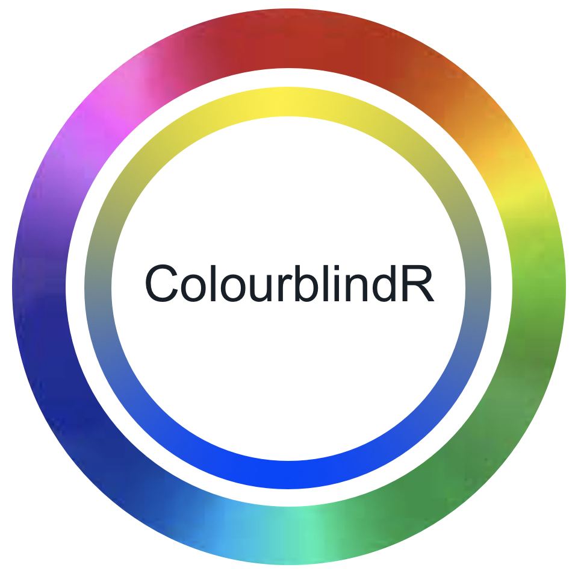

[](https://travis-ci.org/UBC-MDS/ColourblindR)

An R package that creates colourblind friendly themes.

### Authors

| [Ian Flores](https://github.com/ian-flores) | [Sabrina Tse](https://github.com/sabrinatkk) | [Hayley Boyce](https://github.com/hfboyce)

### Project Summary  

`ColourblindR`, deployed in March 2019, is a brand new theme package implemented for `ggplot2` to optimize graphs into a format interpretable by people with colourblindness. Colourblindness, also known as colour vision deficiency, is a condition that affects individuals how they perceive colours visually. According to [colourblindawareness.org](http://www.colourblindawareness.org/colour-blindness/), colourblindness affects 1 in every 12 men and 1 in every 200 women globally. The package is inspired by the fact that people without knowledge about this condition don't know how to make their graphs accesible. Our objective is to enhance data visualization by implementing proper colours so that the graphs are perceived correctly by all readers as intended.

### Functions Included In This Package

- `theme_deutera()`:
    - This function implements a theme that makes plots accessible to people with deuteranopia. It modifies the colour of geometric objects (points, lines, etc) and the layout of the plot.
- `theme_prota()`
    - This function implements a theme that makes plots accessible to people with protanopia. It modifies the colour of geometric objects (points, lines, etc) and the layout of the plot.
- `theme_trita()`
    - This function implements a theme that makes plots accessible to people with tritanopia. It modifies the colour of geometric objects (points, lines, etc) and the layout of the plot.


### Installation

To start using ColourblindR, the installation guidelines are as followed:

1. Ensure devtools is installed. If not, open the console and input the following to install devtools from CRAN.:

```
install.packages("devtools")
```

2. Load `devtools`  by inputting the following in the console:

```
library(devtools)
```

3. Install `ColourblindR` package by inputting the following into the console:

```
devtools::install_github("ubc-mds/colourblindr", build_opts = c("--no-resave-data", "--no-manual"))
```

### Usage

For all functions it is necessary to import both ColourblindR and ggplot2

```
library(ColourblindR)
library(ggplot2)
```

##### `theme_deutera(colour_type)`

**Input:**

`colour_type`: either "fill" or "colour" or "color" (both colour/color do the same thing)

**Output:**

A visualization with a deuteranopia friendly colour palette and theme.

**Examples:**

```
ggplot(data = iris, aes(x = Petal.Length))  + 
    geom_density(aes(fill = Species), colour = NA, alpha= 0.7) + 
    theme_deutera("fill")
```

<p float="left">
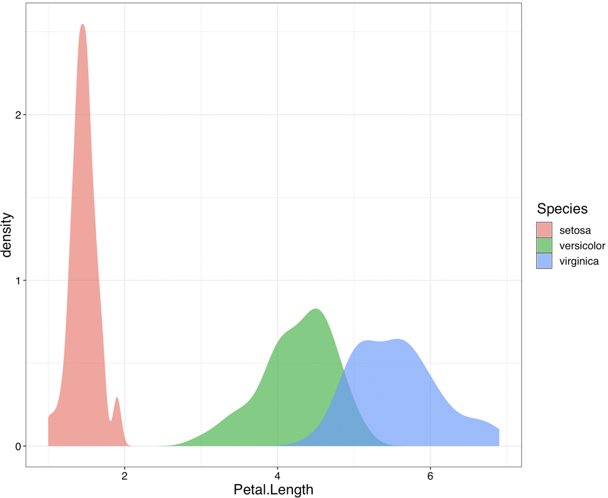
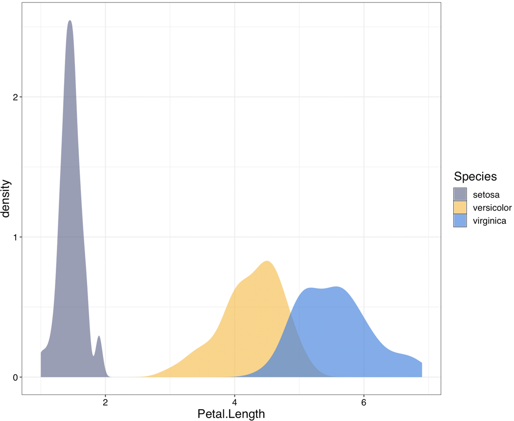
</p>

###### Plot before (left) and after adding theme_deutera("fill") (right)

```
ggplot(data = iris, aes(x = Sepal.Length, y = Sepal.Width, colour = Species)) + 
    geom_smooth(method = "lm", size = 3, se = FALSE) + 
    theme_deutera("colour")
```

<p float="left">
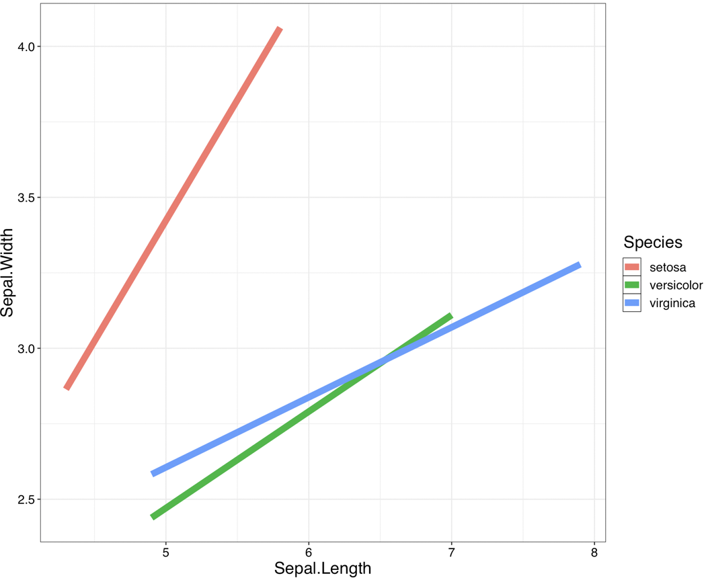
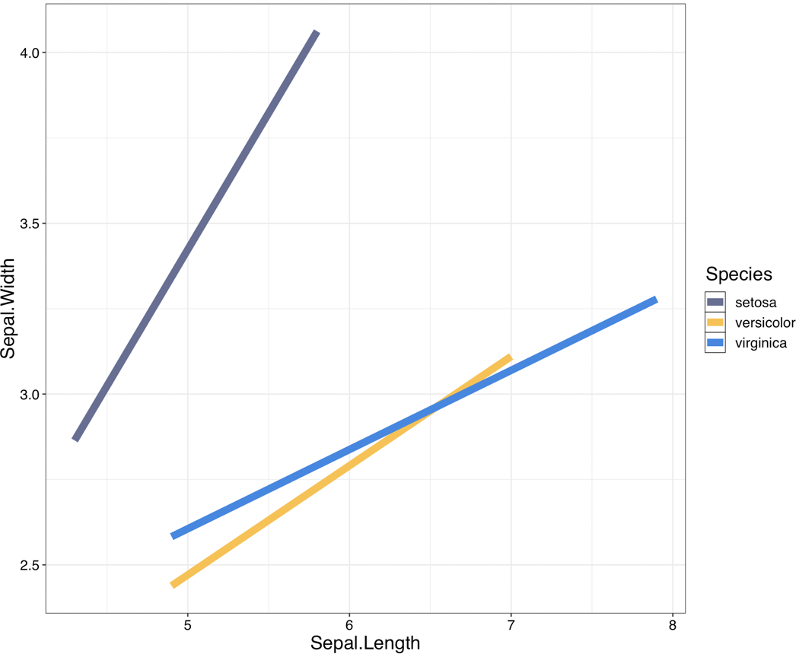
</p>

###### Plot before (left) and after adding theme_deutera("colour") (right)


##### `theme_prota(colour_type)`

**Input:**

`colour_type`: either "fill" or "colour" or "color" (both colour/color do the same thing)

**Output:**

A visualization with a  protanopia friendly colour palette and theme.

**Examples:**

```
ggplot(data = iris, aes(x = Sepal.Length, y = Sepal.Width))  + 
    geom_point(aes(color = Species), size = 5) + 
    theme_prota("colour")
```

<p float="left">
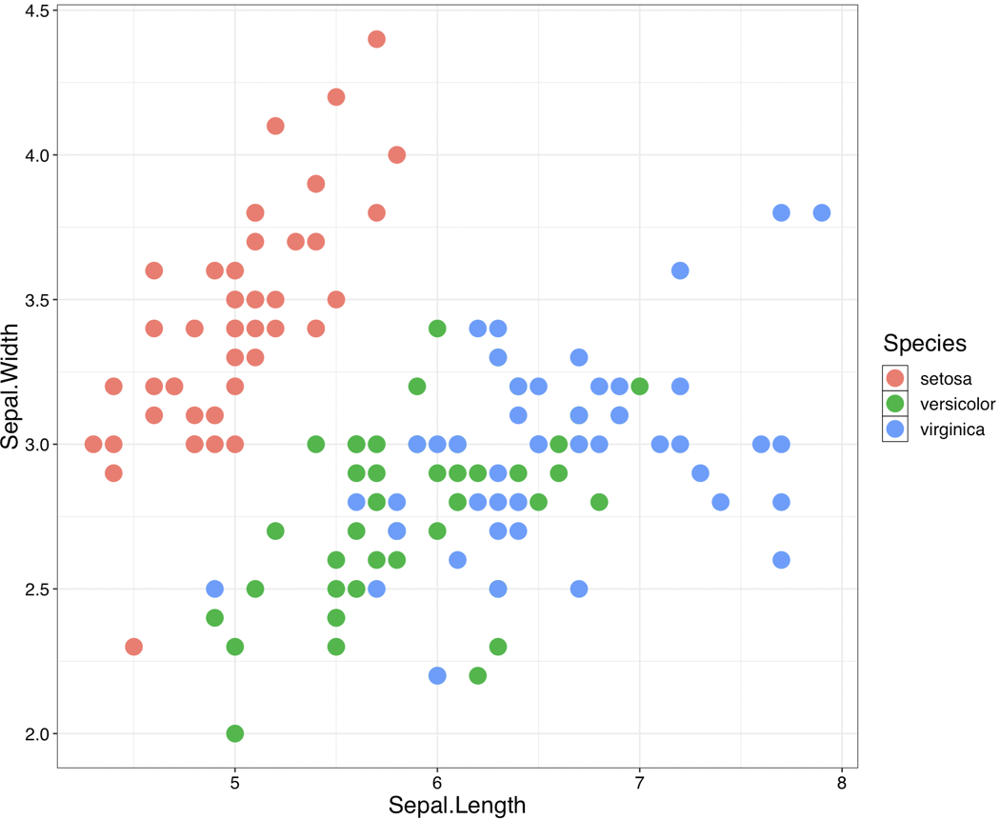
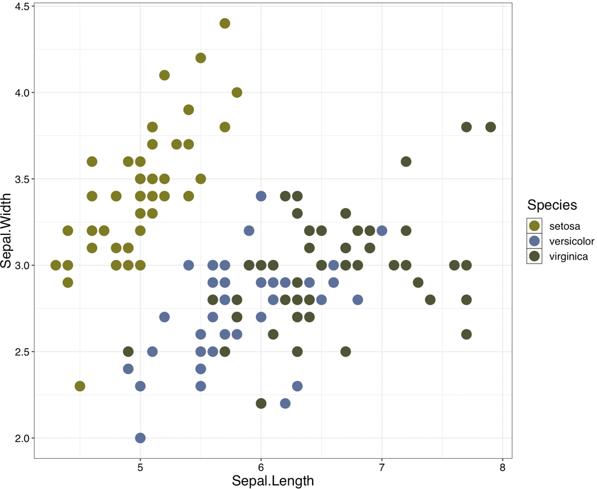
</p>

###### Plot before (left) and after adding theme_prota("colour") (right)

```
ggplot(data = iris, aes(x = Sepal.Width))  + 
    geom_histogram(aes(fill = Species), bins = 15) + 
    theme_prota("fill")
```

<p float="left">
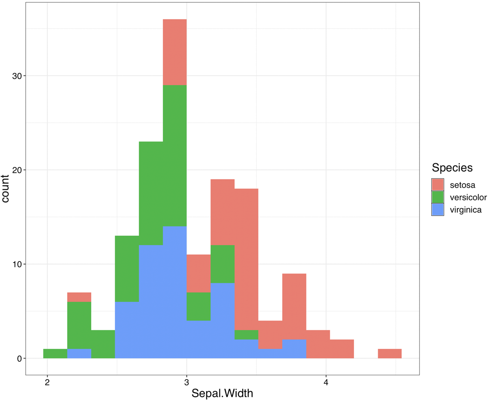
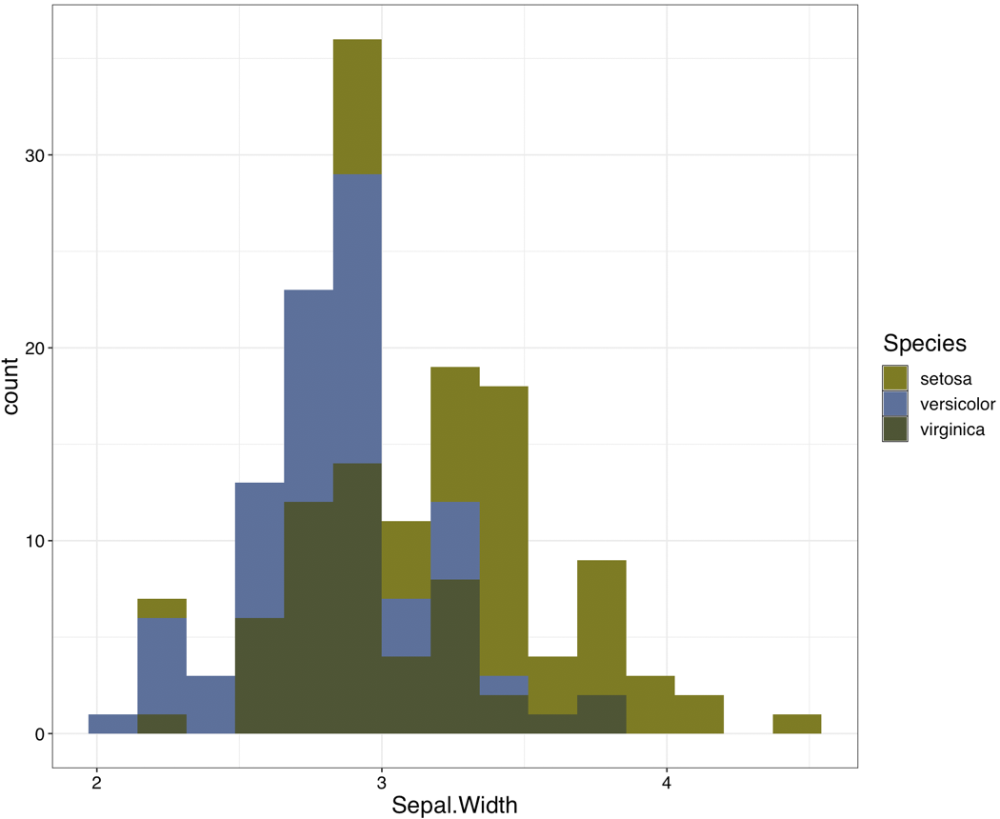
</p>

###### Plot before (left) and after adding theme_prota("fill") (right)


##### `theme_trita(colour_type)`

**Input:**

`colour_type`: either "fill" or "colour" or "color" (both colour/color do the same thing)

**Output:**

A visualization with a tritanopia friendly colour palette and theme.

**Examples:**

```
ggplot(data = iris, aes(x = Species, y = Sepal.Length)) + 
    geom_boxplot(aes(fill = Species)) + 
    theme_trita("fill")
```

<p float="left">
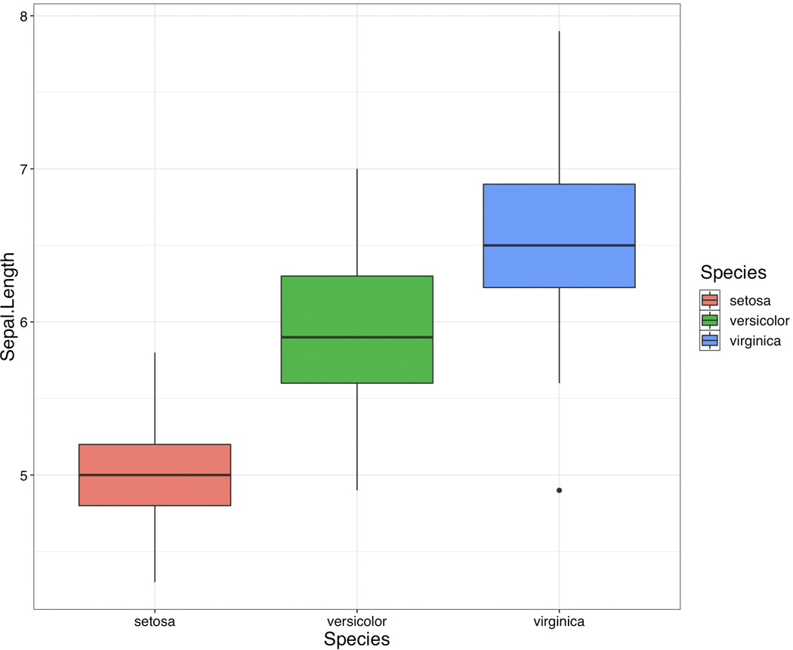
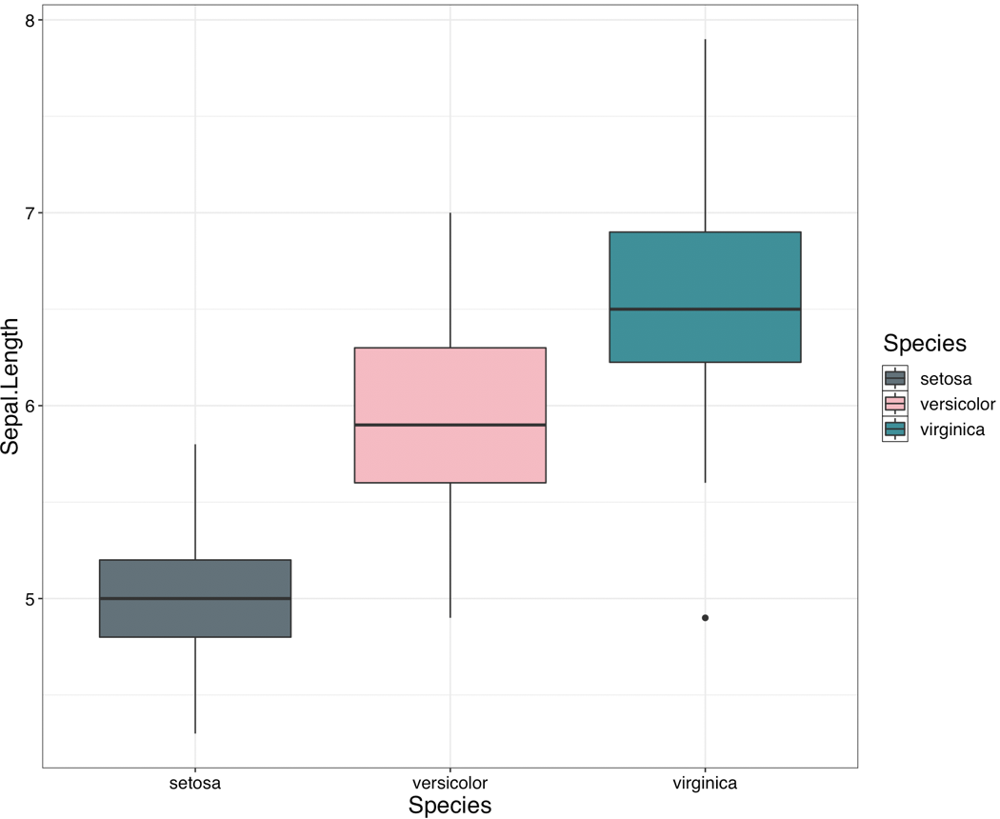
</p>

###### Plot before (left) and after adding theme_trita("fill") (right)


```
ggplot(data=iris, aes(x = Sepal.Width))  + 
    geom_density(aes(colour = Species), size = 2.4 ) + 
    theme_trita("colour")
```

<p float="left">
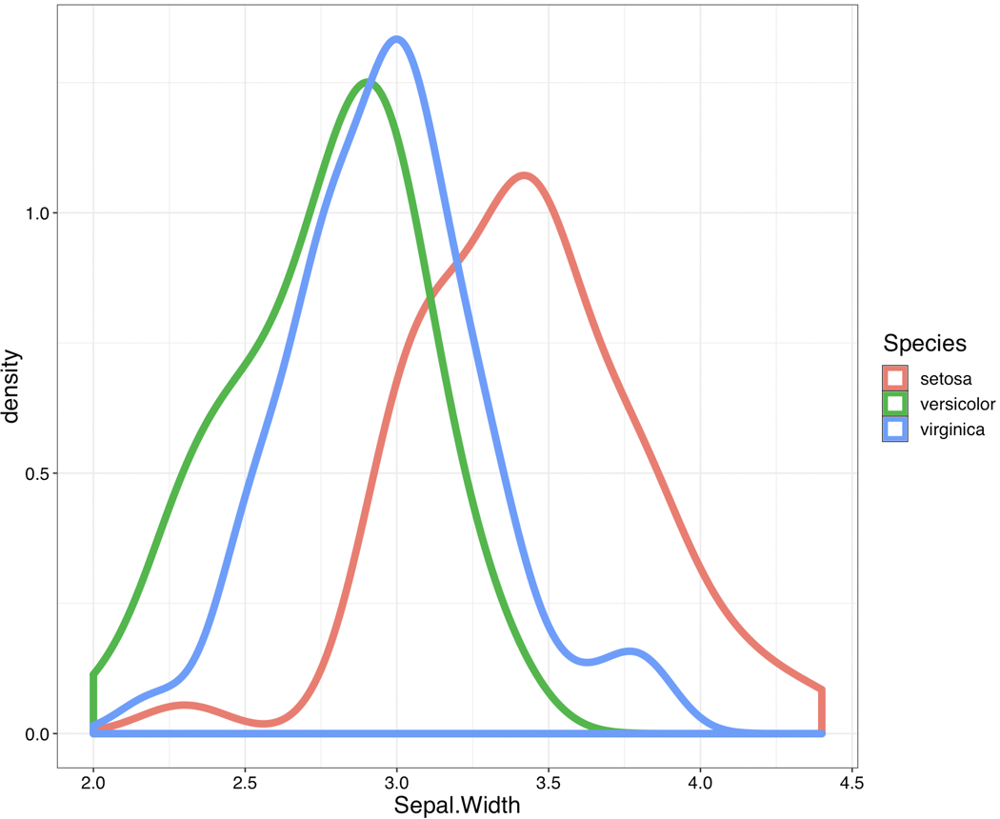
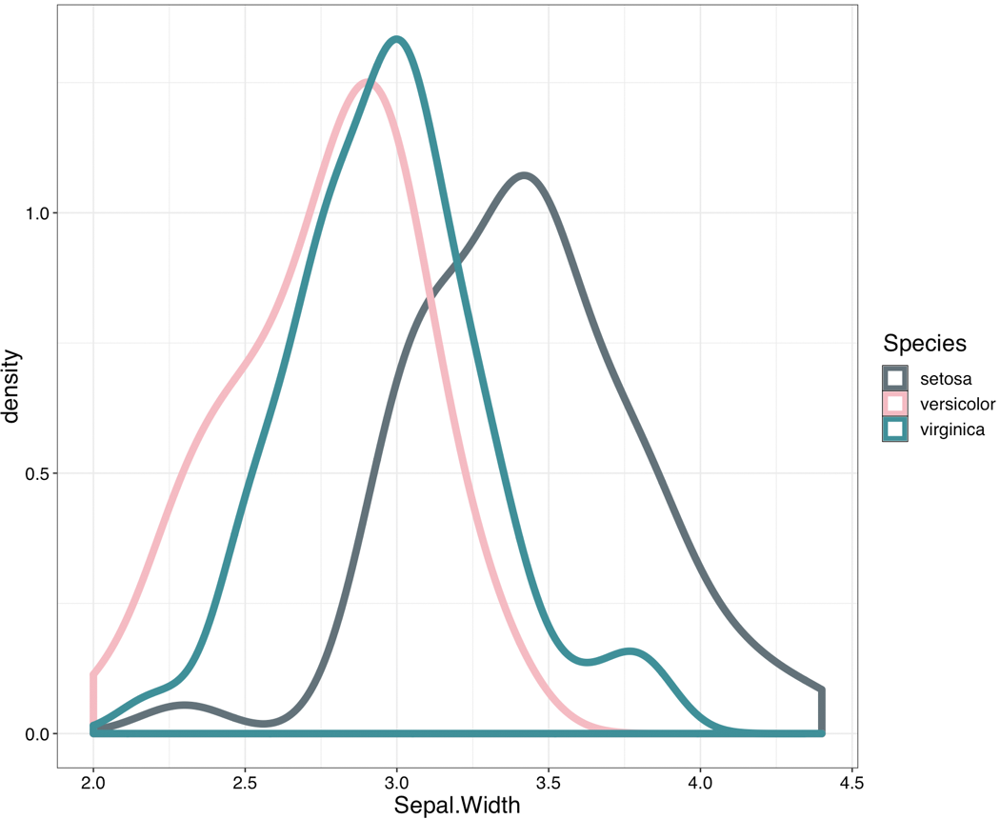
</p>

###### Plot before (left) and after adding theme_trita("colour") (right)


Check out the package vignette for more information and a complete demonstration in Rstudio_by entering the following:

 - `vignette("colourblindr")` for viewing inside Rstudio viewer

 or

 - `browseVignettes(package="ColourblindR")` for viewing in a browser
